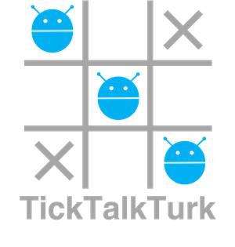

# TickTalkTurk
TickTalkTurk: Conversational Crowdsourcing Made Easy ([DEMO](https://qiusihang.github.io/ticktalkturk/index.html))



- The workflow of [conversational microtask crowdsourcing](https://qiusihang.github.io/files/publications/chi2020_worker_engagement.pdf) is defined in `./js/ticktalkturk.js` (*taketurn* function).

- The examples of crowdsourcing tasks are in the folder `./tasks/captcha/`.

## Usage

You can use the following code to deploy conversational crowdsourcing tasks on the *Design Layout* page. You can also find the code in `index.html`, which is an example HIT (human intelligence task) for Amazon's Mechanical Turk.

```
<script src="https://assets.crowd.aws/crowd-html-elements.js"></script>

<crowd-form answer-format="flatten-objects" style="position:absolute;top:5px;left:20px;right:20px;bottom:10px">
    <div id="chatbot"></div>
</crowd-form>

<script src="https://qiusihang.github.io/ticktalkturk/js/chatbot.js"></script>
<script src="https://qiusihang.github.io/ticktalkturk/tasks/captcha/task1.js"></script> <!-- load crowdsourcing microtasks -->
<script src="https://qiusihang.github.io/ticktalkturk/js/ticktalkturk.js"></script>
<script>
    var chatbot = new Chatbot(document.getElementById("chatbot"), taketurn);
    // taketurn is a callback function defined in ticktalkturk.js

    window.onload = start_task;
    // start_task is an initialization function defined in ticktalkturk.js

    document.querySelector('crowd-form').onsubmit = function(e) {
        if ( document.getElementById("chat-answers").value == "" ) e.preventDefault();
    };
</script>
```
